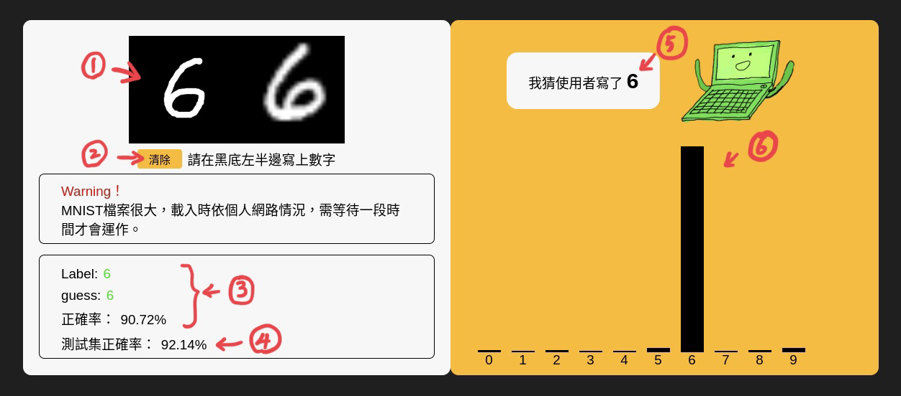

# 手寫辨識系統
2023年下學期「機器學習」期中專題作業，使用原生JavaScript（ Without AI Framework）完成。
1. [手寫辨識系統-操作網頁](https://noz915.github.io/handwritten-digit-recognize/)
2. [手寫辨識系統-書面報告](https://docs.google.com/document/d/1rr5zYhyqjCPjA4YRM3auWU2gf8vIYx3rRjxAwBY7UhU/edit?usp=sharing)
3. [手寫辨識系統-Demo影片](https://www.youtube.com/watch?v=fKIbeqtwQpk)

## 頁面


## 頁面說明
網站載入後，需等候MNIST資料集載入的時間（自己測試約需一分半的時間），等待開始跑動後，手寫辨識系統才算開始運作。

以下將依照上圖所標示之1.~6.做說明：
1. 利用p5.js（為一個以JavaScript為基礎的繪圖函式庫），建立canvas，讓使用者可以在該canvas上作圖。
2. 除了按下空白鍵可以清除畫布之外，新增一個清除按鈕，供平板、手機也可使用。
3. 此處的label、guess以及正確率，為MNIST資料集進到神經網路不斷作training的過程。
4. 測試集正確率則為MNIST資料集進到神經網路，確保不會發生overfitting。
5. 使用者在canvas寫上數字後會經過處理，並經過神經網路去預測，給出一個有十個元素的陣列，其中元素數字最高者，該index值即為神經網路預測使用者畫的數字。
6. 承 5. ，利用原生CSS刻出長條圖，將預測出來的陣列給視覺化。

## 主要架構
```
handwritten-digit-recognize
├─ lib
│     ├─ nn.js
│     └─ matrix.js
├─ sketch.js
├─ mnist.js
└─ index.html
```

1. **nn.js：神經網路系統**  
    利用JS中的class定義一個建構器函式 NeuralNetwork( ) ，之後可以用new來呼叫該class。並且再定義兩個function：predict( )、train( ) ，所有NeuralNetwork物件實例都可以使用這兩個function。
   
2. **matrix.js：各種矩陣的一般式**  
    同樣利用class的方式建立建構式函式。先宣告建構式函式Matrix，並可傳入三個參數：rows, cols。
   
3. **sketch.js：圖像處理**  
    前面都是神經網路的邏輯，這邊就是用來處理手寫辨識的部分。主要處理的地方，就是把使用者寫的數字作轉換，以及讀取MNIST資料集處理之後，放入神經網路學習。
   

## 參考資料
1. [Coding Train - 10: Neural Networks - The Nature of Code](https://www.youtube.com/playlist?list=PLRqwX-V7Uu6aCibgK1PTWWu9by6XFdCfh)
2. [3Blue1Brown - Neural Networks](https://www.youtube.com/playlist?list=PLZHQObOWTQDNU6R1_67000Dx_ZCJB-3pi)
3. [Live Stream #120: MNIST and Pendulums](https://www.youtube.com/watch?v=KhogNPC24eI)
4. [Machine Learning (Hung-yi Lee, NTU)](https://www.youtube.com/playlist?list=PLJV_el3uVTsPy9oCRY30oBPNLCo89yu49)
